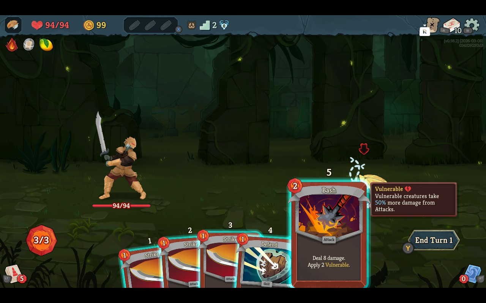
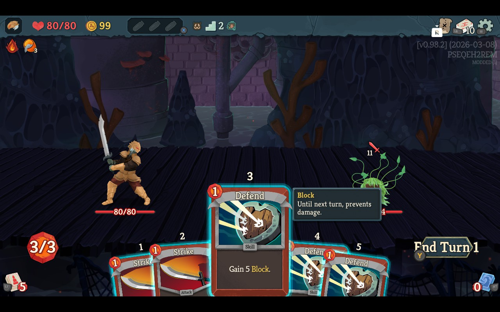

# Slay the Spire 2 Font Size Runtime Mod

Slay the Spire 2 has a lot of text that is too small on Steam Deck. This mod makes the game broadly more readable by scaling the main UI text paths and adding a few targeted bumps for the stubborn tiny holdouts.

This repo is set up for the simple path:
- clone it
- tweak a few values
- build
- deploy to your Deck

For deeper notes, save migration, and troubleshooting, see [GUIDE.md](GUIDE.md). For maintainer-level notes, see [STS2_FONT_MOD_MASTER_NOTES.md](STS2_FONT_MOD_MASTER_NOTES.md).

## What it changes

- scales `MegaLabel`
- scales `MegaRichTextLabel`
- scales plain Godot `Label` / `RichTextLabel`
- scales BBCode font-size paths in `Godot.RichTextLabel`
- adds extra bumps for:
  - version/build footer text
  - patch notes text
  - secondary preview-card description text
- covers the shared character-select starter-relic description path

## Example

| Before (`1.0x`) | After (`1.2x`) |
| --- | --- |
|  |  |

## Quickstart

1. Clone the repo.
2. Copy `.env.example` to `.env`.
3. Edit `.env` for your Deck and preferred font sizes.
4. Build:

```bash
./scripts/build-runtime-mod.sh
```

5. Make sure STS2 is closed on the Deck.

```bash
./scripts/check-running.sh
```

6. Deploy:

```bash
./scripts/deploy-runtime-mod.sh
```

7. Launch the game.

## Values You Probably Want To Change

In `.env`:

- `STS2_PATCH_SCALE`
  - main global text scale
- `STS2_DEBUG_FOOTER_EXTRA_SCALE`
  - extra bump for version/build footer text
- `STS2_PATCH_NOTES_EXTRA_SCALE`
  - extra bump for release notes text
- `STS2_PREVIEW_CARD_DESCRIPTION_EXTRA_SCALE`
  - extra bump for the description text on secondary preview cards

Current defaults:

- `STS2_PATCH_SCALE=1.20`
- `STS2_DEBUG_FOOTER_EXTRA_SCALE=0.50`
- `STS2_PATCH_NOTES_EXTRA_SCALE=0.25`
- `STS2_PREVIEW_CARD_DESCRIPTION_EXTRA_SCALE=0.20`

## Required `.env` Fields

- `STS2_DECK_HOST`
- `STS2_MODS_DIR`
- `STS2_LOG_PATH`
- `STS2_GODOT_EXPORTER`

Quote values that contain spaces.

## Useful Commands

Build:

```bash
./scripts/build-runtime-mod.sh
```

Deploy:

```bash
./scripts/deploy-runtime-mod.sh
```

Check if the game is running:

```bash
./scripts/check-running.sh
```

Fetch the Deck log:

```bash
./scripts/fetch-log.sh
```

## Notes

- Build output goes to `runtime_mod/build/`.
- `font_size_config.json` is generated from your current `.env` values during build.
- The deploy script refuses to overwrite live mod files if STS2 is running.
